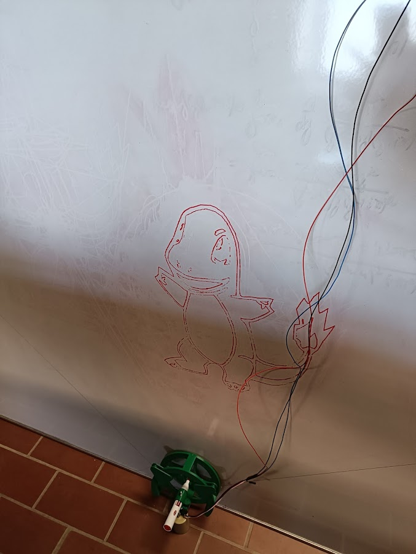

# RoboGraphx
The goal of this project is to develop a system that can write and erase on a blackboard, and draw some basic figures.

## Usage/Examples

Right now, the system can draw most Gcode on a whiteboard

Supported commands: 
- **G... X... Y... F...**
    - **G** determines the command type
        - **G0** is a travel move (no writing)
        - **G1** is a writing move
        - **G90** specifies that the following coordinates will be absolute to the system origin
        - **G91** is the same but for relative coordinates
        - **G28** is a homing command, resetting the system to the start position
    - **X** and **Y** determine the target X and Y coordinates
    - **F** sets the stepper motor speed [steps/second]
- **M5** and **M3 S255**
    - **M5** engages the servo such that the pen is touching the whiteboard
    - **M3 S255** disengages the pen
- **A...,...**
    - To set the X and Y board positions
    - Automatically generated by the Python GUI code

The best way to generate usable Gcode is to convert a SVG to Gcode using [Inkscape](https://inkscape.org/) and the [J Tech Photonics Laser Tool](https://github.com/JTechPhotonics/J-Tech-Photonics-Laser-Tool) extension

## Installation

### Electronics
The following circuit has to be made twice, once for each stepper motor

[Source](https://howtomechatronics.com/tutorials/arduino/stepper-motors-and-arduino-the-ultimate-guide/)
The pins on the arduino can be found in the arduino code, they can also be changed there if desired. The source voltage should be +12V and ground. The breadboard connections look like this:

For controlling the pen, a servo motor is used. The to be connected pins can also be found in the arduino code. Here also put a diagram

Parts list:
 - Arduino Uno
 - NEMA 17 stepper motor
 - DRV8825 Stepper Motor Controller
 - Decoupling capacitor
 - Any generic servo motor
 - Some wires

Almost all these parts are interchangable with similar parts
### Arduino code
### Python code
### 3D printed parts
### Making suitable Gcode
[test](../documents/gcode-guide)
## Possible Future Features

- Improving the workflow
    - Input the dimensions (board size, offsets) in the GUI
    - One program / GUI to convert images to Gcode and also to draw the Gcode
- Clean up the setup (Better cables, make a PCB, ...)
- Typing text into the GUI -> Gcode -> writing on the board
    - Some default drawings, eg. writing 'Smith Chart' will draw a smith chart
- Make the signals to arduino wireless (Bluetooth/Wifi)
